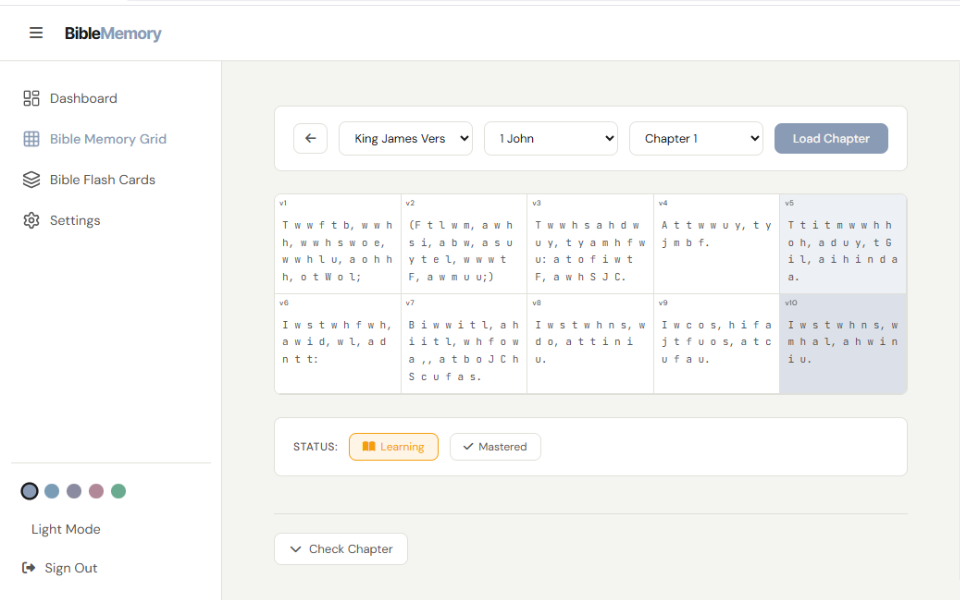
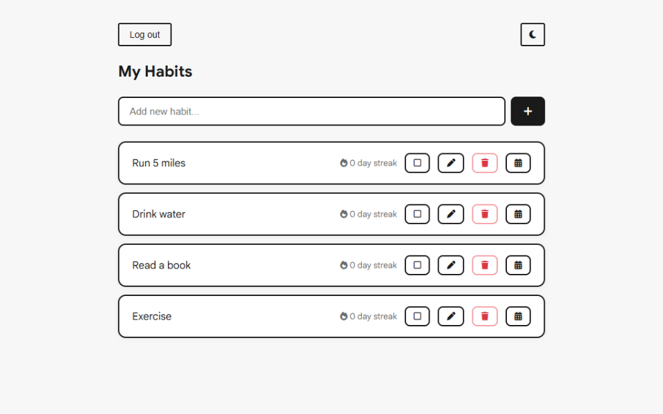
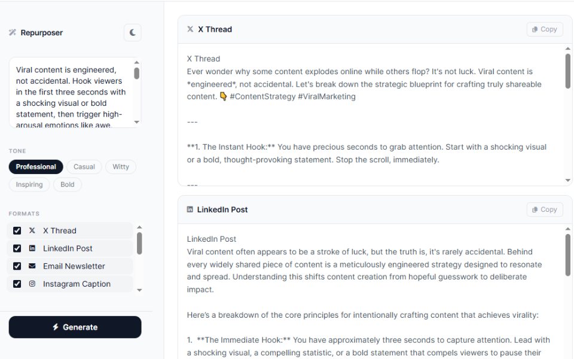

<h1 align="center">Hi, I'm Donovan 👋</h1>

  Front-end developer building self-directed projects, one feature at a time.

  
  
  

---

### 🛠️ What I'm building

- **[BibleMemory](https://bible-memory-project-chi.vercel.app/)** — A Bible memory web app with flash cards, streak tracking, and a dark-first design system. Built with React, Supabase, and the Bolls Life Bible API.

- **[Habitly](https://habit-tracker-ddgit.vercel.app/)** — A habit tracking app with streak calculation and a GitHub-style contribution heatmap. Built with React and Supabase.

- **[Repurposer](ai-repurposing-tool.vercel.app)** — Turns long-form content into multi-platform posts using the Gemini API, with tone selection and a responsive mobile UI.

---

### ⚙️ Skills

Frontend

       

Backend

  

Design

   

Tools

    

---

<em>Currently building incrementally, one project at a time.</em>

